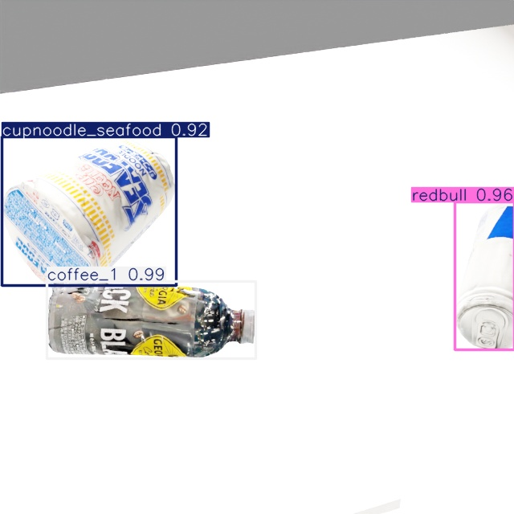
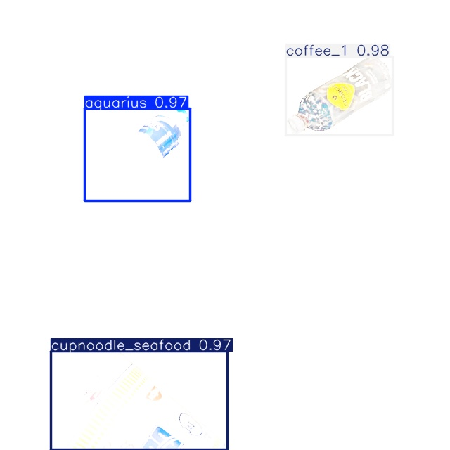
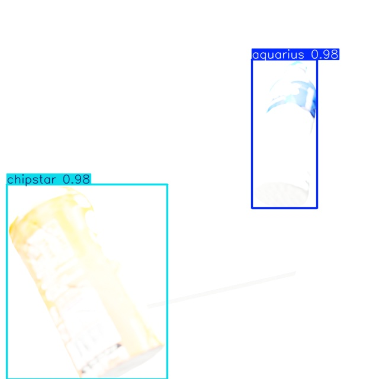

# tidbots 6-Class Training Results Report

**Date:** 2026-02-03
**Model:** YOLO26m
**Dataset:** tidbots 6-class synthetic data

## Target Classes

| Class ID | Class Name | Description |
|----------|------------|-------------|
| 0 | aquarius | Aquarius (beverage) |
| 1 | chipstar | Chipstar (snack) |
| 2 | coffee_1 | Coffee 1 (Georgia) |
| 3 | coffee_2 | Coffee 2 |
| 4 | cupnoodle_seafood | Cup Noodle Seafood |
| 5 | redbull | Red Bull (beverage) |

## Dataset Composition

| Item | Value |
|------|-------|
| Total Images | 2,000 |
| Annotations | 3,710 |
| Training Data | 1,667 images |
| Validation Data | 166 images |
| Test Data | 167 images |
| Image Resolution | 640x640 |

## Training Configuration

| Parameter | Value |
|-----------|-------|
| Base Model | yolo26m.pt |
| Epochs | 50 |
| Batch Size | 16 |
| Image Size | 640 |
| Optimizer | AdamW |
| Learning Rate | 0.001 |
| GPU | NVIDIA GPU (11.5GB used) |

## Training Results

### Final Metrics

| Metric | Value |
|--------|-------|
| **mAP50** | **99.16%** |
| **mAP50-95** | **96.48%** |
| Box Loss | 0.23 |
| Class Loss | 0.08 |
| DFL Loss | 0.003 |

### Training Time

- **Total Training Time:** ~15 minutes (0.254 hours)
- **Per Epoch:** ~18 seconds

## Inference Test Results

| Item | Value |
|------|-------|
| Test Images | 167 |
| Total Detections | 307 |
| Avg Inference Time | 5-7ms/image |
| Confidence Threshold | 0.5 |

### Detection Result Samples


*Detection example: cupnoodle_seafood (92%), coffee_1 (99%), redbull (96%)*


*Detection example: aquarius (97%), coffee_1 (98%), cupnoodle_seafood (97%)*


*Detection example: aquarius, chipstar*

### Per-Class Detection Confidence (Samples)

| Class | Confidence |
|-------|------------|
| coffee_1 | 98-99% |
| aquarius | 97% |
| cupnoodle_seafood | 92-97% |
| redbull | 96% |
| chipstar | 95%+ |
| coffee_2 | 95%+ |

## Output Files

```
runs/detect/outputs/trained_models/tidbots_6class/
├── weights/
│   ├── best.pt          # Best model (44MB)
│   ├── last.pt          # Final model (44MB)
│   ├── epoch0.pt        # Checkpoints
│   ├── epoch10.pt
│   ├── epoch20.pt
│   ├── epoch30.pt
│   └── epoch40.pt
├── labels.jpg           # Label distribution
├── results.csv          # Training metrics
└── args.yaml            # Training configuration
```

## Inference Command

```bash
docker compose run --rm yolo26_train python3 /workspace/scripts/evaluation/inference.py \
  --model /workspace/runs/detect/outputs/trained_models/tidbots_6class/weights/best.pt \
  --source /path/to/images \
  --output /workspace/outputs/inference_results
```

## Configuration File

### config.yaml (excerpt)

```yaml
model_sources:
  tidbots:
    path: "/workspace/models/tidbots"
    include: []  # 6 classes: aquarius, chipstar, coffee_1, coffee_2, cupnoodle_seafood, redbull

scene:
  num_images: 2000
  objects_per_scene: [1, 3]
```

## Technical Notes

### Scale Normalization

tidbots models are created in millimeter units, so the `normalize_object_scale()` function in `generate_dataset.py` automatically normalizes them to meter units (~15cm).

```python
def normalize_object_scale(obj, target_size=0.15):
    """Normalize model scale"""
    bbox = obj.get_bound_box()
    max_dim = max(dimensions)
    scale_factor = target_size / max_dim
    obj.set_scale([s * scale_factor for s in current_scale])
```

### GPU Configuration

The following GPU settings are required in docker-compose.yml:

```yaml
deploy:
  resources:
    reservations:
      devices:
        - driver: nvidia
          count: 1
          capabilities: [gpu]
```

## Reproduction Steps

1. **Data Generation**
   ```bash
   docker compose run --rm blenderproc blenderproc run \
     /workspace/scripts/blenderproc/generate_dataset.py --num_scenes 2000
   ```

2. **COCO to YOLO Conversion**
   ```bash
   docker compose run --rm yolo26_train python3 \
     /workspace/scripts/data_processing/coco_to_yolo.py \
     --coco_json /workspace/data/synthetic/coco/annotations.json \
     --output_dir /workspace/data/synthetic/yolo
   ```

3. **Training**
   ```bash
   docker compose run --rm yolo26_train python3 \
     /workspace/scripts/training/train_yolo26.py \
     --data /workspace/data/synthetic/yolo/dataset.yaml \
     --weights /workspace/weights/yolo26m.pt \
     --epochs 50 \
     --name tidbots_6class
   ```

4. **Inference**
   ```bash
   docker compose run --rm yolo26_train python3 \
     /workspace/scripts/evaluation/inference.py \
     --model /workspace/runs/detect/outputs/trained_models/tidbots_6class/weights/best.pt \
     --source /path/to/test/images \
     --output /workspace/outputs/inference_results
   ```

## Related Documentation

- [Custom Objects Only Training Guide](custom-only-training-e.md)
- [Adding Custom Models](custom-models-e.md)
- [Configuration Reference](configuration-e.md)
